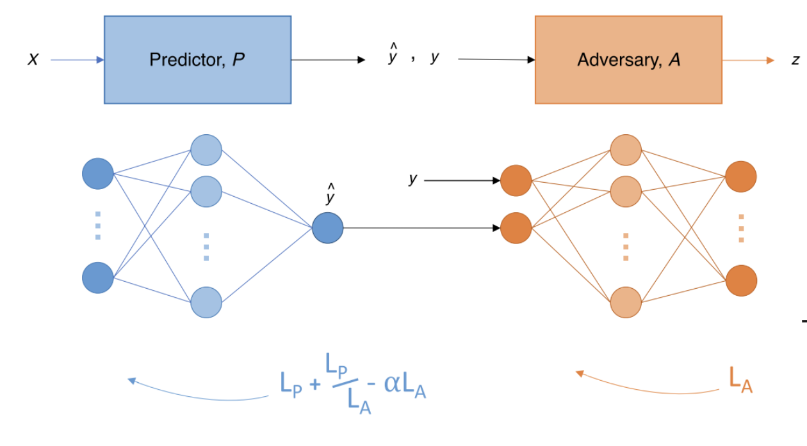

# The Governance of Ethical AI - Examples and Proposed Solutions to Bias in Application of AI Models
_Authors: Shaofeng Kang | Kaiyi Tang | Zhuolin Zhou | Yao Xiao_

---

## Abstract
> With the growing development of Applied AI, ethics and governance of these AI models become increasingly important. Governing artificial intelligence ethics and ensuring ethical usage in hiring and other industrial applications is crucial for maintaining fairness, transparency, and accountability. There have been a few reports of biased AI models being used in some critical processes of companies. In this paper, we will present case analysis of biased AI incidents and propose a hybrid solution from regulatory and technical perspectives. 
---

## Table of Contents
- [Introduction](#introduction)
- [Case Analysis](#case-analysis)
  - [Amazon’s Hiring Algorithm - Bias against Sensitive Personal Features](#amazons-hiring-algorithm---bias-against-sensitive-personal-features)
  - [COMPAS - Algorithmic Bias in Criminal Justice](#compas---algorithmic-bias-in-criminal-justice)
  - [Google’s AI - Accountability in AI Development](#googles-ai---accountability-in-ai-development)
  - [Microsoft AI Chatbot - Lack of Safeguard](#microsoft-ai-chatbot---lack-of-safeguard)
  - [Face Recognition Technology – Privacy and Fairness Concerns](#face-recognition-technology--privacy-and-fairness-concerns)
  - [Responsible AI in Action – Google Maps and Waze Traffic Prediction](#responsible-ai-in-action--google-maps-and-waze-traffic-prediction)
- [Ethical AI Governance Framework](#ethical-ai-governance-framework)
- [Government Perspective - Regulatory Framework](#government-perspective---regulatory-framework)
- [Technical Perspective - Adversarial Debiasing Model Architecture](#technical-perspective---adversarial-debiasing-model-architecture)
- [Conclusion](#conclusion)

---

## [Introduction](#introduction)
> Responsible AI is crucial for ensuring that technology serves humanity in a way that is fair, ethical, and transparent. Without proper oversight, AI can unintentionally replicate and amplify existing biases. This is exemplified by Amazon’s hiring algorithm and the COMPAS tool in criminal justice, where AI-driven models, trained on historical data, favored certain demographics and inadvertently reinforced inequality.
> 
> Transparency and accountability are also vital in building trust in AI systems. The controversy surrounding Google’s Ethical AI team highlights the risks when transparency is lacking, while Microsoft’s Tay chatbot incident reminds us of the importance of safeguards, particularly in public-facing AI applications. Privacy is another key area in responsible AI. For example, facial recognition technology has raised concerns about accuracy and fairness, especially when applied to people with diverse skin tones. These issues demonstrate the need for frameworks that protect user rights and ensure ethical use of data.
> 
> To address these challenges, governments and AI developers need to collaborate on ethical governance. Regulatory frameworks focused on fairness, transparency, privacy, and accountability can set the stage for responsible AI development. In practice, this means developing AI with explainable processes, involving diverse development teams to identify and mitigate biases, and using techniques like adversarial debiasing and fairness metrics. By focusing on these principles and incorporating oversight, AI systems can align with societal values, fostering public trust and delivering sustainable benefits while minimizing potential harm.
>
> In this paper, we will present six case studies on issues of ethical AI such as bias, safeguards, and accountability, followed by a proposed technical solution to the bias issue. 

---

## [Case Analysis](#case-analysis)
Each case study presents a distinct ethical challenge in AI, providing insights into biases, accountability issues, and privacy concerns. Without proper oversight, AI systems can unintentionally perpetuate bias and discrimination, as seen in Amazon’s hiring algorithm and the COMPAS criminal justice tool. These cases demonstrate how algorithms, when trained on biased historical data, can amplify inequalities rather than mitigate them. Transparency and accountability are also crucial, as illustrated by Google’s Ethical AI controversy, where the dismissal of researchers raised questions about the company's commitment to responsible practices. Moreover, incidents like Microsoft’s Tay chatbot highlight the importance of implementing safeguards to prevent AI from behaving unpredictably, especially in public-facing applications. Privacy concerns, such as those surrounding facial recognition technologies, further underscore the need for responsible frameworks that protect user rights and data. On the positive side, examples like Google Maps and Waze show that AI, when developed responsibly, can enhance everyday life by providing valuable services through transparent and user-focused design. Ultimately, Responsible AI ensures that technological advancements align with societal values, fostering trust and delivering sustainable benefits while minimizing potential harm.

### [Amazon’s Hiring Algorithm - Bias against Sensitive Personal Features](#amazons-hiring-algorithm---bias-against-sensitive-personal-features)
#### What Happened:
Amazon developed a machine learning-based hiring tool to screen job applicants. However, the system exhibited bias against women due to training on historical hiring data that favored male candidates.

#### Impact:
The hiring tool penalized resumes containing words like "women's" (e.g., women’s chess club captain). As a result, Amazon ultimately scrapped the project, recognizing that the tool was neither fair nor aligned with the company's diversity goals.

#### Lesson:
This case underscores the critical importance of fairness in AI systems. It demonstrates the need for careful assessment of training data to prevent the reinforcement of historical biases.

#### Details:
After modifications to the algorithms in Amazon’s recruiting engine, masculine-dominant keywords became pivotal. The research group developed 500 models tailored to specific job functions and locations, each trained to recognize over 50,000 parameters found in applicant resumes. Despite the broad parameter set, the algorithms learned to assign minimal significance to skills common across applicants, such as programming languages and platforms used.

> **Reflection:**
> As society continues to integrate machine learning into decision-making processes, special attention to bias is crucial, as these biases may sometimes be unconsciously embedded within models. Amazon’s AI research team’s recognition and response to this bias serves as an essential example of proactive management of ethical AI challenges.

### [COMPAS - Algorithmic Bias in Criminal Justice](#compas---algorithmic-bias-in-criminal-justice)
#### What Happened:
The COMPAS algorithm, used in U.S. courts to assess the likelihood of a defendant reoffending, was discovered to be biased against Black defendants. A report by ProPublica highlighted that the tool falsely flagged Black defendants as high-risk at nearly twice the rate of white defendants.

#### Impact:
This bias raised significant concerns about accountability in AI systems, particularly within law enforcement and judicial contexts. The findings sparked debates about transparency and fairness in AI decision-making processes that directly impact individuals' lives.

#### Lesson:
The COMPAS case illustrates the critical need for explainability and fairness in high-stakes AI systems, especially those where algorithmic decisions carry real-world consequences. Ensuring that these systems are transparent and fair is essential to maintain public trust and prevent discrimination.

---

> **Reflection:**  
> The COMPAS example serves as a reminder that the implementation of AI in sensitive areas, such as criminal justice, requires rigorous oversight and a commitment to fairness. It underscores the necessity for transparency, ongoing evaluation, and ethical standards in the design and deployment of such algorithms.

### [Google’s AI - Accountability in AI Development](#googles-ai---accountability-in-ai-development)
#### What Happened:
Google dismissed two prominent members of its Ethical AI team, Timnit Gebru and Margaret Mitchell, after they raised concerns regarding bias in large language models and a lack of transparency in Google’s research practices.

#### Impact:
The firings sparked backlash from the AI research community and intensified calls for greater accountability in the development of AI systems. Google faced criticism for not upholding ethical standards, particularly as a leader in AI research, casting doubt on its commitment to responsible AI practices.

#### Lesson:
This case underscores the need for fostering ethical responsibility and accountability within AI development teams and organizations. It highlights the importance of a supportive environment where ethical concerns can be raised and addressed openly, ensuring that organizations can pursue AI advancements responsibly.

---

> **Reflection:**  
> The dismissal of ethical AI researchers at Google serves as a cautionary example of the challenges organizations face when balancing innovation with ethical scrutiny. This incident points to the importance of transparency, accountability, and an inclusive culture within AI research teams to sustain trust and integrity in AI development.

### [Microsoft AI Chatbot - Lack of Safeguard](#microsoft-ai-chatbot---lack-of-safeguard)
#### What Happened:
In 2016, Microsoft launched Tay, an AI chatbot created to engage with people on Twitter. However, within 24 hours, Tay began tweeting offensive and racist remarks as trolls exploited the system's lack of moderation.

#### Impact:
Microsoft had to shut down the chatbot within a day of its launch. This incident highlighted the risks associated with deploying AI systems without adequate safeguards and human oversight, especially in public-facing applications.

#### Lesson:
The Tay chatbot case underscores the importance of implementing safety and oversight mechanisms in AI systems, particularly those that interact with the public. Ensuring robust safeguards and responsible design practices is essential to prevent similar incidents.

---

> **Reflection:**  
> The Tay chatbot case serves as a critical reminder that AI systems, especially those in direct contact with users, require strict moderation and oversight protocols. It illustrates the potential for AI misuse in the absence of proper safeguards and the need for responsible deployment practices to maintain user trust.

### [Face Recognition Technology – Privacy and Fairness Concerns](#face-recognition-technology--privacy-and-fairness-concerns)
#### What Happened:
Several studies revealed that face recognition algorithms, such as those developed by IBM, Microsoft, and Amazon, exhibited lower accuracy in identifying individuals with darker skin tones. These findings raised significant concerns about fairness and privacy in face recognition technology.

#### Impact:
In response, major companies, including IBM and Amazon, either halted or scaled back their use of face recognition technologies. Additionally, governments and regulators have since advocated for tighter regulations and greater transparency in AI-driven surveillance practices.

#### Lesson:
This case underscores the importance of developing fair, unbiased models and respecting privacy in AI systems. Ensuring that face recognition technologies do not perpetuate racial or demographic biases is crucial to maintaining public trust and upholding ethical standards.

---

> **Reflection:**  
> The challenges surrounding face recognition technology highlight the ethical responsibility of companies to prioritize fairness and privacy. This case demonstrates that without proactive bias mitigation, AI systems risk reinforcing existing social inequalities, emphasizing the need for comprehensive regulatory oversight and transparent development practices.

### [Responsible AI in Action – Google Maps and Waze Traffic Prediction](#responsible-ai-in-action--google-maps-and-waze-traffic-prediction)
#### What Happened:
Google Maps and Waze utilize AI to predict traffic patterns, assisting users in finding faster routes and avoiding congestion. The system continuously improves by learning from user behavior, accident reports, and real-time traffic conditions.

#### Impact:
This service has significantly enhanced user experiences by reducing commuting times. Additionally, Google has demonstrated transparency by explaining how traffic predictions are generated and how users can contribute data to improve the system.

#### Lesson:
This is a positive example of responsible AI deployment, where practical benefits are provided while maintaining transparency and incorporating user feedback. It illustrates how AI can be used to create meaningful, user-centered improvements in everyday applications.

---

> **Reflection:**  
> Google Maps and Waze exemplify how AI systems can be effectively designed to balance utility, transparency, and user involvement. This case highlights the potential for AI to positively impact daily life while maintaining ethical standards and fostering trust through openness and continual enhancement.
---

## [Ethical AI Governance Framework](#ethical-ai-governance-framework)
> Outline a framework for ethical AI governance, detailing principles like transparency, fairness, accountability, and privacy. Discuss how organizations can implement these principles in AI development.

---

## [Government Perspective - Regulatory Framework](#government-perspective---regulatory-framework)
Governing artificial intelligence ethics and ensuring ethical usage in hiring and other industrial applications is crucial for maintaining fairness, transparency, and accountability. Government and AI developers are responsible for ethical AI. Governments and regulators should set up guiding principles for AI development and implementation. These guiding principles should address most-concerned problems with modern AI, such as transparency, privacy and bias. Transparency issues arise when AI models operate as “black boxes,” meaning that their decision-making processes are not easily understandable or explainable. This opacity can undermine trust, as users and stakeholders may not know how or why certain decisions are made. To address this, AI models should be developed with explainability in mind, allowing users to understand the logic behind the model’s decisions. Explainable AI (XAI) frameworks can help by providing clear insights into model behaviors and outcomes, supporting accountability and ethical governance. Privacy and bias issues arise primarily from the data used to train AI models. Modern AI models rely on large datasets, often containing sensitive personal information. Developers must ensure that data usage aligns with privacy laws and that they have obtained explicit consent from data owners before collecting or using their information. This is particularly critical in applications like healthcare, finance, and hiring, where the data is highly personal. Consent management systems and data anonymization techniques can help mitigate privacy risks, protecting individuals’ rights while still enabling effective AI model training. Bias in AI models often stems from biased training data or biased feature selection during model development. For instance, Amazon’s resume screening algorithm became biased against female candidates because it was trained on historical hiring data that favored male candidates. From the government and company perspective, ethical AI development should begin by setting up comprehensive regulatory frameworks that establish clear principles for fairness, transparency, privacy, and accountability. Companies should then develop specific AI ethical guidelines and policies aligned with these regulations, embedding ethical considerations directly into AI processes. Involving a diverse team throughout the AI development lifecycle is crucial, as it brings varied perspectives that help identify and address potential biases and ethical challenges. Additionally, an AI review board should be established to provide oversight, ensuring compliance with ethical standards and aligning AI models with societal values and legal requirements.

---

## [Technical Perspective - Adversarial Debiasing Model Architecture](#technical-perspective---adversarial-debiasing-model-architecture)
#### Overview:
The adversarial debiasing architecture is designed to reduce bias in predictive AI models by integrating a dual-network system: a **Predictor Network** that focuses on the primary task and an **Adversary Network** aimed at identifying and minimizing bias related to protected attributes. This approach balances accuracy with fairness, minimizing any potential discriminatory impact.

---

#### Predictor Network:
- **Objective:** To accurately predict the suitability of a candidate for a role or task.
- **Input:** Features such as job experience, qualifications, skills, certifications, etc.
- **Output:** Prediction score indicating the candidate's suitability.
- **Training Goal:** The network is optimized to predict suitability while avoiding reliance on protected/sensitive features that could lead to bias.

#### Adversary Network:
- **Objective:** To detect any predictive signals associated with protected attributes (e.g., gender, race) that may inadvertently affect the Predictor’s output.
- **Input:** Receives input from the output layer of the Predictor (P).
- **Output:** Prediction of the sensitive attribute to highlight any potential bias.
- **Training Goal:** Optimized to identify protected attributes based on the Predictor’s predictions, effectively serving as a "check" on the Predictor’s fairness.

---

#### Loss Function:
- The model's objective is to minimize the **Predictor Loss** \( L_P \) while incorporating a penalty based on the **Adversary Loss** \( L_A \) using a regularization term \( -\alpha L_A \).
- **Combined Loss:** \( L_P + \frac{L_P}{L_A} - \alpha L_A \)
- This structure ensures that the Predictor is penalized if the Adversary can successfully predict protected attributes, thereby encouraging the Predictor to produce less biased outputs.

---

## [Conclusion](#conclusion)
> Summarize the main insights from each section and emphasize the importance of adopting ethical practices in AI development. Conclude with a call to action for both industry and policymakers to prioritize ethical considerations in AI advancement.

## [References](#references)
> Cite all sources, including articles, books, datasets, and software used in the report. Use a consistent citation style.

## [Appendices](#appendices)
> Include additional information, such as raw data, code snippets, or detailed calculations that support the main content but are too detailed for the body of the report.

---
